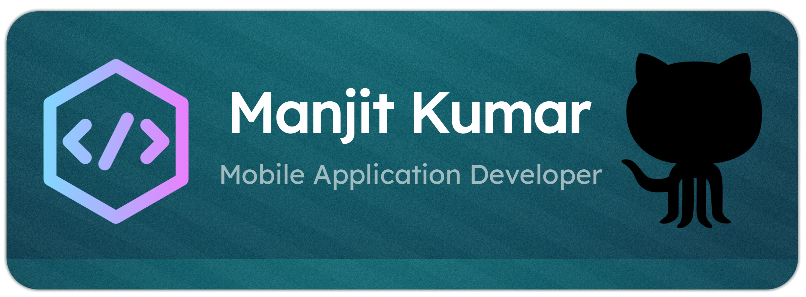

  

## 💫 ABOUT ME

✦ I’m a dedicated Mobile Application Developer and Full Stack Developer with a MERN background, focused on building intuitive, efficient, and user-driven solutions across platforms. My passion lies in creating mobile apps that not only work seamlessly but also deliver real value to users.
_______
✦ With a strong foundation in both frontend and backend, I bring a complete development perspective to every project. I’m constantly evolving, open to challenges, and driven to contribute to meaningful, high-impact work.
___________
✦ Driven by curiosity and a desire to grow, I continuously improve my skills, adapt to challenges, and aim to deliver meaningful solutions. I value clean design, intuitive user flow, and strong collaboration.
________
✦ My goal is to contribute to innovative projects, learn from great teams, and grow as a well-rounded developer who creates value through technology.
______

## 🌐 Connect With Me

---

---

## 🛠 Tech Stack

#### 🎨 Frontend & Design

#### ⚙️ Backend & Databases

#### 📱 Mobile Development

#### ☁️ DevOps & Tools

---

# 📊 GitHub Stats
 
 

) 

### ✍️ Random Dev Quote

### 🔝 Top Contributed Repo

---

---

